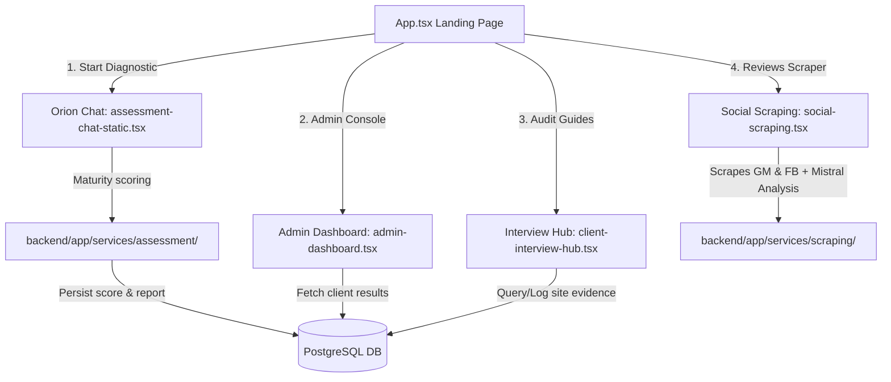

# Project Context: EY CX Assessment Hub

Welcome! This document provides a comprehensive technical overview of the entire EY CX Assessment Hub codebase, its modules, flow, files, database structure, and architecture. It is designed as your transfer-of-knowledge map.

---

## 1. Product Vision & Architecture

The EY CX Assessment Hub is a premium audit platform designed for consultants to evaluate corporate customer experience (CX) maturity, run dynamic AI diagnostic chats, generate custom interview guides, and analyze public brand sentiment.

---

## 2. Codebase Map (Where to Read Exactly)

### A. The Landing Page & Navigation Routing
*   **[`frontend/src/App.tsx`](file:///c:/Users/HAMZA/Desktop/EY/CX_Chat/frontend/src/App.tsx)**: Main entry point. Declares landing segments (`Hero`, `Features`, `HowItWorks`, `CTASection`) and routes view rendering for lazy-loaded pages (`/admin`, `/client-interview-hub`, `/social-scraping`).
*   **[`frontend/src/index.css`](file:///c:/Users/HAMZA/Desktop/EY/CX_Chat/frontend/src/index.css)**: Implements the core premium styling system, animations, scroll-behaviors, and color variables.

### B. Orion Assessment Chat & Scoring Engine
*   **[`frontend/src/components/ui/assessment-chat-static.tsx`](file:///c:/Users/HAMZA/Desktop/EY/CX_Chat/frontend/src/components/ui/assessment-chat-static.tsx)**: Client-side chat workspace. Manages dialogue flow, multi-choice inputs, and local chat states.
*   **[`backend/app/services/assessment/lifecycle_service.py`](file:///c:/Users/HAMZA/Desktop/EY/CX_Chat/backend/app/services/assessment/lifecycle_service.py)**: Manages diagnostic state transitions, dynamic follow-up checks, and scoring hooks.
*   **[`backend/app/services/assessment/scoring/`](file:///c:/Users/HAMZA/Desktop/EY/CX_Chat/backend/app/services/assessment/scoring)**: Calculates scores across 5 maturity levels for the 9 core capabilities.

### C. Client Interview Guides & Reports
*   **[`frontend/src/components/ui/client-interview-hub.tsx`](file:///c:/Users/HAMZA/Desktop/EY/CX_Chat/frontend/src/components/ui/client-interview-hub.tsx)**: Interactive workbook interface for auditors on-site. Shows capability details, target evidence checklists, and quick win templates.
*   **[`backend/app/services/assessment/reporting/reporting_service.py`](file:///c:/Users/HAMZA/Desktop/EY/CX_Chat/backend/app/services/assessment/reporting/reporting_service.py)**: Generates scoring grids, evidence reports, and compiles the final maturity output structure.

### D. Social Media Reviews Scraping & Sentiment Dashboard
*   **[`frontend/src/components/ui/social-scraping.tsx`](file:///c:/Users/HAMZA/Desktop/EY/CX_Chat/frontend/src/components/ui/social-scraping.tsx)**: Front-end scraping hub. Includes:
    *   Dropdown selector to instantly load archived reports from disk.
    *   Excel exporter (`exportToExcel`) that writes all parsed reviews and comments into a unified **"All Feedback"** sheet.
*   **[`backend/app/api/routes/scraping.py`](file:///c:/Users/HAMZA/Desktop/EY/CX_Chat/backend/app/api/routes/scraping.py)**: Handles endpoints:
    *   `GET /scraping/companies`: Populates company selector.
    *   `GET /scraping/reports` & `GET /scraping/reports/{filename}`: Reads and loads archived reports.
    *   `POST /scraping/run`: Triggers scraping and persists new companies into PostgreSQL `companies` table using `_determine_sector_id()` fallback logic.
*   **[`backend/app/services/scraping/scraping_service.py`](file:///c:/Users/HAMZA/Desktop/EY/CX_Chat/backend/app/services/scraping/scraping_service.py)**: Spawns concurrent scraper tasks:
    *   *Google Maps*: Apify (`maxReviews: 40`).
    *   *Facebook*: 2-stage posts-to-comments Bright Data scraper (`limit_records: 10` per post). Uses `_is_relevant_comment` to filter spam, short, or tag comments.
    *   *Archiver*: Saves every execution raw response as `{brand}_report_{timestamp}.json`.
*   **[`backend/app/services/scraping/classification_service.py`](file:///c:/Users/HAMZA/Desktop/EY/CX_Chat/backend/app/services/scraping/classification_service.py)**: Slices reviews proportionally (**up to 40 Google Maps reviews + 40 Facebook comments**) and queries the Mistral LLM to categorize polarity, themes, and summary.

---

## 3. Database & Seeding Setup

*   **Database**: PostgreSQL connection URI is loaded via the `DATABASE_URL` key inside `backend/.env`.
*   **Schema & Migrations**: Located under `backend/migrations/` (from schema creation to axis scoring, maturity rules, and templates).
*   **Seeding Execution**: `backend/seed.py` connects to the DB, checks migration logs, and runs unapplied migration scripts sequentially.
